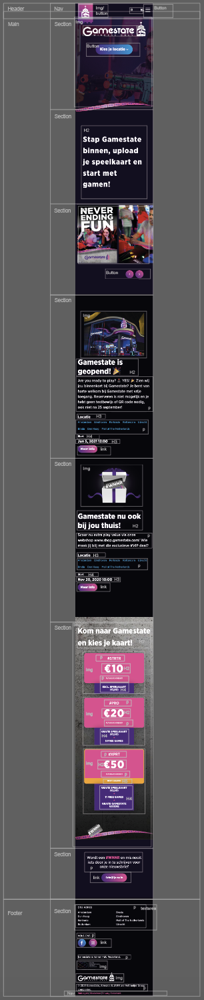
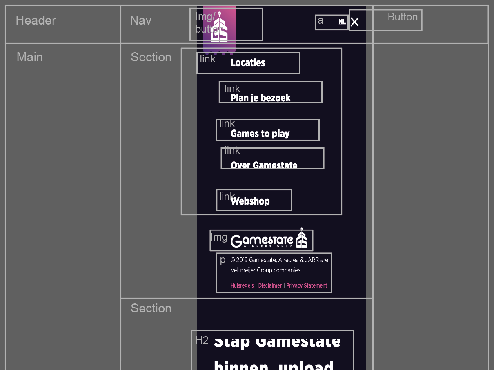
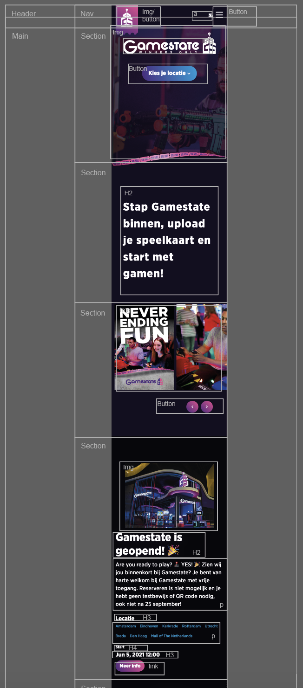
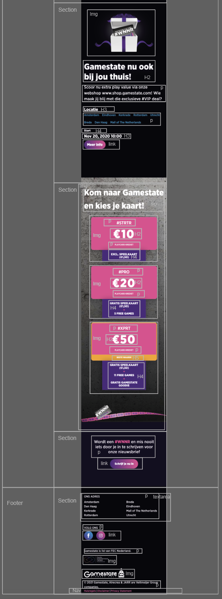
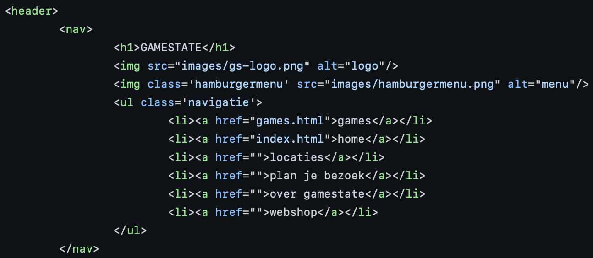
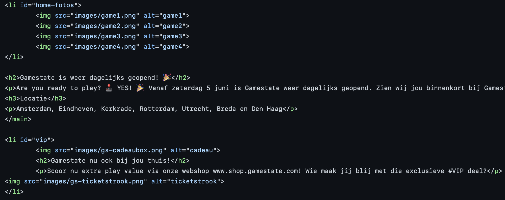

# Procesverslag
Markdown is een simpele manier om HTML te schrijven.  
Markdown cheat cheet: [Hulp bij het schrijven van Markdown](https://github.com/adam-p/markdown-here/wiki/Markdown-Cheatsheet).

Nb. De standaardstructuur en de spartaanse opmaak van de README.md zijn helemaal prima. Het gaat om de inhoud van je procesverslag. Besteedt de tijd voor pracht en praal aan je website.

Nb. Door *open* toe te voegen aan een *details* element kun je deze standaard open zetten. Fijn om dat steeds voor de relevante stuk(ken) te doen.

## Jij

uitwerken voor kick-off werkgroep

### Auteur:
Sanae Akhiat

#### Je startniveau:
Blauw

#### Je focus:
Surface plane
 

## Je website

uitwerken voor kick-off werkgroep

### Je opdracht:
https://www.gamestate.com

#### Screenshot(s) van de eerste pagina (small screen): 
Homepagina  

#### Screenshot(s) van de tweede pagina (small screen):
Pagina met overzicht van de games 

 

## Breakdownschets (week 1)

uitwerken na afloop 2e werkgroep

### de hele pagina: 

### dynamisch deel (bijv menu): 

### close up van de bovenkant van dehomepagina: 

### close up van de bovenkant van de homepagina: 

## Voortgang 1 (week 2)

uitwerken voor 1e voortgang

### Stand van zaken
Het maken van de breakdown schets heeft geholpen met het begrijpen van de structuur van de website. Door de site te hebben ontleden had ik een beter beeld van de gebruikte elementen. Nu was het mijn beurt om te beginnen met de code. Voor het eerste gesprek had ik niet al te veel code om te laten zien. Ik was begonnen met het verzamelen van de content die ik wilde gebruiken. Ik heb een hamburgermenu gemakt voor het navigeren op de site, daarnaast heb ik de main content van de homepagina geplaatst.

### code hamburgermenu: 

### code: 

### Agenda voor meeting
samen met je groepje opstellen

| student 1      | student 2          | student 3    | student 4        |
| ---            | ---                | ---          | ---              |
| dit bespreken  | en dit             | en ik dit    | en dan ik dat    |
| en dat ook nog | dit als er tijd is | nog een punt | dit wil ik zeker |
| ...            | ...                | ...          | ...              |

### Verslag van meeting
hier na afloop snel de uitkomsten van de meeting vastleggen

- Hamburgermenu is werkend, alleen moet het anders gestyled worden.
- Veel gebruik gemaakt van id's
- <li> correct gebruiken
- Gebruik maken van sections

## Voortgang 2 (week 3)

uitwerken voor 2e voortgang

### Stand van zaken
Ik heb een begin gemaakt aan mijn tweede pagina. Overigens heb ik hier nog niet l te veel content op. Ik heb op beide pagina's afgeweken van de originele site. Ik wilde er namelijk een eigen draai op geven. Ik heb op de eerste pagina een interactie toegevoegd door een afbeelding te laten roteren bij een hover. De tweede pagina was lastig te positioneren omdat ik grid nog lastig vind te gebruiken.

### Agenda voor meeting
samen met je groepje opstellen

| student 1      | student 2          | student 3    | student 4        |
| ---            | ---                | ---          | ---              |
| dit bespreken  | en dit             | en ik dit    | en dan ik dat    |
| en dat ook nog | dit als er tijd is | nog een punt | dit wil ik zeker |
| ...            | ...                | ...          | ...              |

### Verslag van meeting
hier na afloop snel de uitkomsten van de meeting vastleggen

- Ipv grid flexbox gebruiken
- Hoeveelheid divs en classes verminderen
- Afbeeldingen anders schalen
- geen gebruik maken van pixels om de grootte mee uit te drukken maar percentages of ems

## Toegankelijkheidstest (week 4)

uitwerken na test in 8e voortgang

### Bevindingen
In deze offline les hebben we testen gedaan om de toegankelijkheid van de website te bepalen. Als eerst hebben we gebruik gemaakt van de VoiceOver fuctie. Zo konden we gedeeltelijk beleven wat een blinde ervaart op het web. We hebben ook verschillende brillen op gehad om je site mee te bekijken. Deze brillen hadden het doel je te laten zien wat iemand ziet met een beperking aan zijn/haar zicht. En als laatst hebben we een test gedaan met een elastiek om onze vingers, zo konden we aandacht schenken aan de motoriek van de website.

Lijst met je bevindingen die in de test naar voren kwamen:

#### Brillen test

#### Combined eyeloss (diabetes)
De kleuren waren prima te zien en het contrast was goed. Hetgeen dat aangepast kan worden is de lettergrootte van bepaalde p elementen.

#### Blur/glare 
Het contrast van de website is goed waardoor er onderscheid viel te makken tussen de elementen. De abeeldingen waren goed zichtbaar. Hetgeen dat aangepast moet worden is de grootte van het font omdat het niet overal goed te lezen is.

#### Low contrast
Alles was duidelijk te zien met deze bril op.

#### Peripheral field loss 
Door het kleurcontrast op de website was het kijken door deze bril prima te doen. Wel is het vergroten van een aantal afbeeldingen aangeraden.

#### Elastiek test
Met deze test hebben we de motoriek van de website getest. 
De website was te bedienenm met de elastieken. Het navigeren was namelijk niet lastig, scrollen is niet moeilijk en de buttons zijn gemakkelijk in te drukken.

## Voortgang 3 (week 4)

uitwerken voor 3e voortgang

### Stand van zaken
Mijn paginas waren een beetje chaotisch. Ik had namelijk veel moeite met het positioneren van de content. Mijn afbeeldingen veranderde van breedte op de verkeerde manier en mijn grid positioneerde niet hoe ik wilde dat het zou positioneren. Ik was me daar al bewust van en wist dat ik hiermee snle aan de slag moest gaan.

### Agenda voor meeting
samen met je groepje opstellen

| student 1      | student 2          | student 3    | student 4        |
| ---            | ---                | ---          | ---              |
| dit bespreken  | en dit             | en ik dit    | en dan ik dat    |
| en dat ook nog | dit als er tijd is | nog een punt | dit wil ik zeker |
| ...            | ...                | ...          | ...              |

### Verslag van meeting
hier na afloop snel de uitkomsten van de meeting vastleggen

- Ik heb tips gekregen voor positionering
- Gebruik van divs en id's verminderen
- Read.me bijhouden
- Even knallen en de site afmaken, uren maken

## Eindgesprek (week 5)

uitwerken voor eindgesprek

### Stand van zaken
Het einde is aangekomen. Mijn website is af. Ben ik trots? ja ik ben er zeker trots op. Ik heb voorheen veel moeite gehad met gebruik van codes. Ik heb tijdens het maken van deze website zeker moeilijkheden gehad, deze probeerde ik eerst zelf op te lossen doormiddel van google. Mocht het daarna niet zijn gelukt heb ik om hulp gevraagd. Naast dat ik vaak last had met de codes vond ik het wel leuk om te doen. Je kan zeggen dat ik zeker ups en downs heb gehad. Als iets lukte op de manier die ik me had ingebeeld werd ik erg blij. Ik had nooit gedacht dat ik zo enthausiast door kon raken. 

De website wijkt gedeeltelijk af van de originele website maar dat is geen probleem. Ik heb erg mijn best gedaan voor de website en hoop dat meerdere het kunnen inzien.

### Screenshot(s)

hier screenshot(s) van je eindresultaat

### Homepagina mobile device: 

### Homepagina desktop: 

### Games pagina mobile device: 

### Games pagina desktop: 

## Bronnenlijst

continu bijhouden terwijl je werkt

Nb. Wees specifiek ('css-tricks' als bron is bijv. niet specifiek genoeg).

1. https://www.gamestate.com
2. https://css-tricks.com/snippets/css/complete-guide-grid/
3. https://css-tricks.com/snippets/css/a-guide-to-flexbox/
4. https://codepen.io/sanotje/pen/PojKXVM
5. https://codepen.io/shooft/pen/zYzdMwO
6. https://www.w3schools.com/howto/howto_js_mobile_navbar.asp

